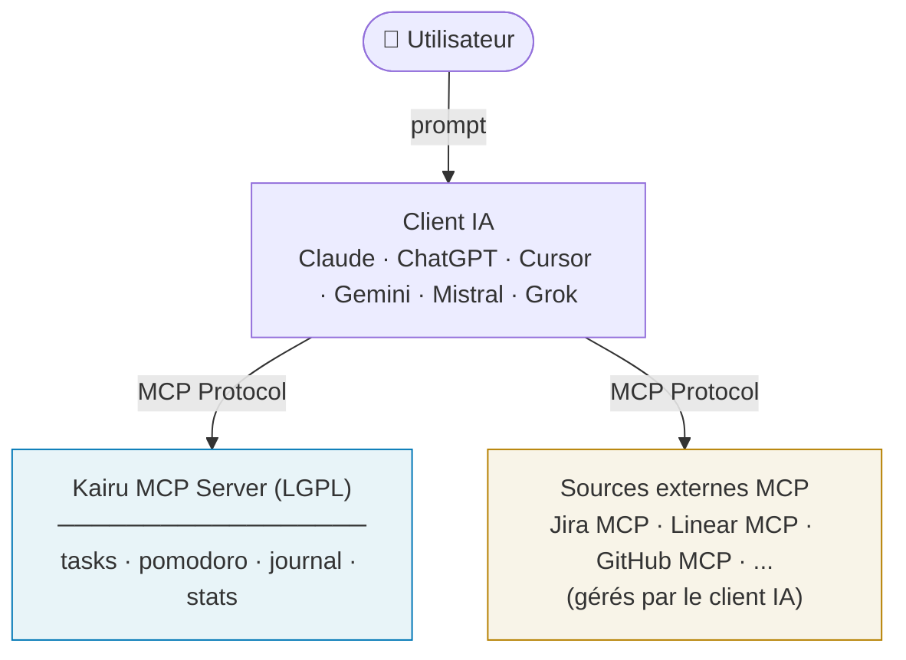
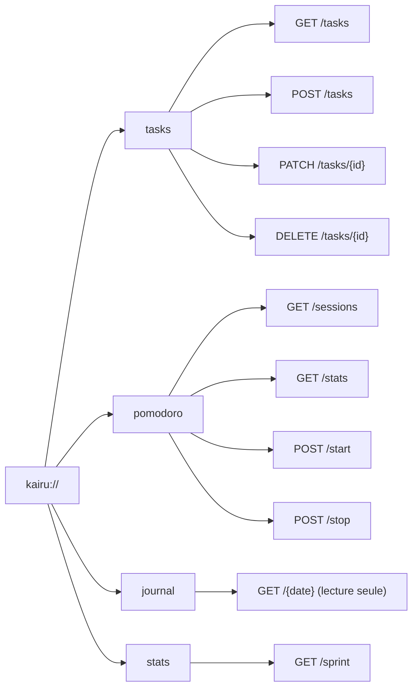
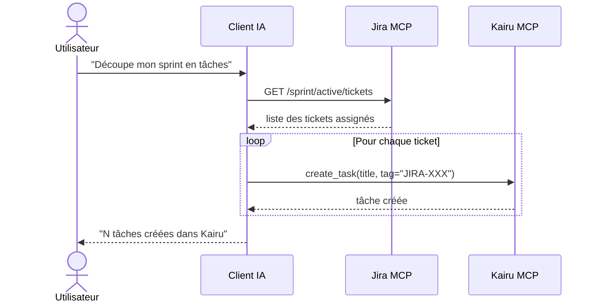
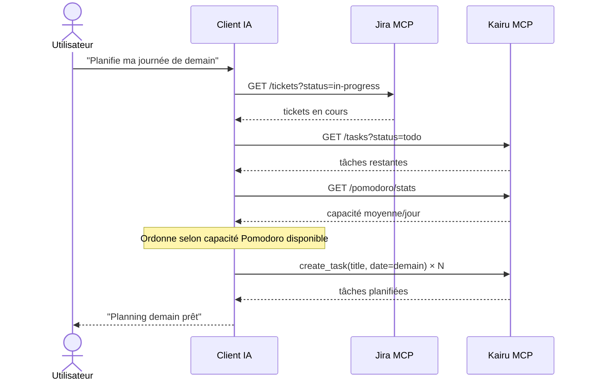
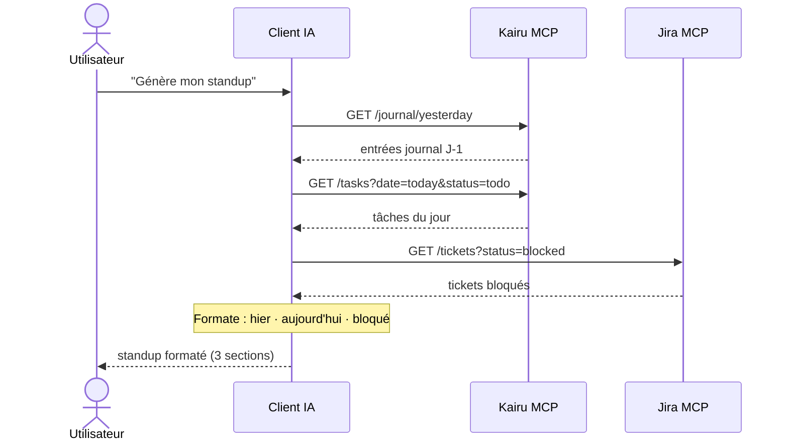
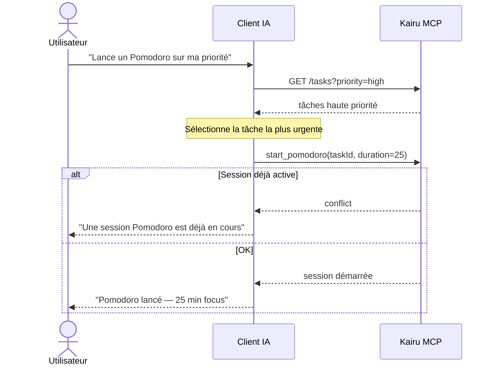
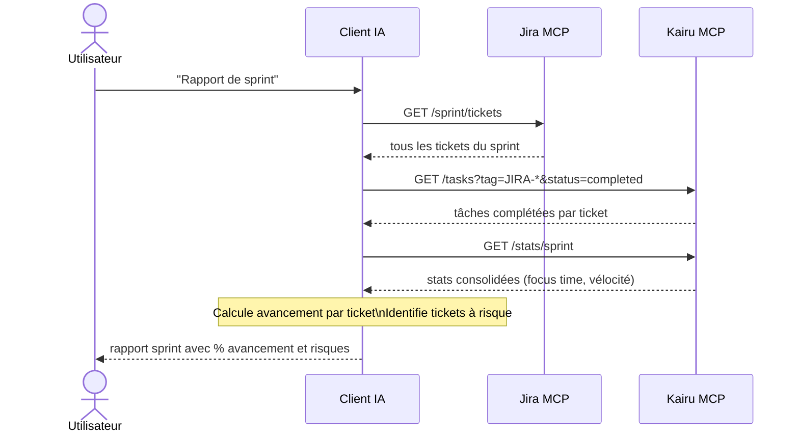
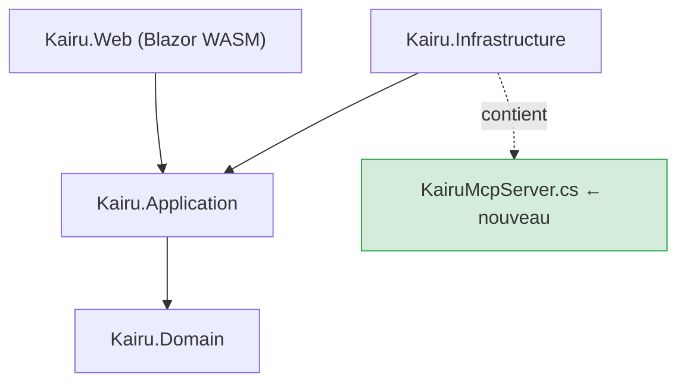

# Kairu — MCP Server Design

**Date :** 2026-04-03
**Statut :** Approuvé
**Itération cible :** À définir

---

## Contexte

Kairu est un hub de productivité destiné à toute personne
souhaitant structurer son temps avec les méthodologies Pomodoro et Agile.

Ce document spécifie l'architecture **Kairu MCP Server** :
Kairu expose ses données (tâches, Pomodoro, journal) via le protocole MCP afin que
tout client IA compatible (Claude, ChatGPT, Cursor, Gemini...) puisse orchestrer
le travail de l'utilisateur.

> Kairu ne se connecte pas aux sources externes (Jira, Linear...).
> C'est le client IA qui orchestre — Kairu stocke.

---

## Décisions structurantes

| Décision | Choix | Raison |
|----------|-------|--------|
| Rôle MCP | MCP Server uniquement | Kairu stocke, l'IA orchestre — pas de couplage avec Jira |
| Protocole | MCP (Model Context Protocol) | Standard universel adopté par tous les majeurs (OpenAI, Google, Microsoft, AWS...) |
| Licence core | LGPL | Protège le core open source |
| Tickets Jira | Tag sur la tâche (ex: `JIRA-101`) | Pas d'affichage Jira dans l'UI — le numéro suffit |
| IA | Claude orchestre, Kairu stocke | Séparation claire des responsabilités |
| Compatibilité | Tout client MCP | Claude, ChatGPT, Cursor, Gemini, Mistral, Grok... |

---

## Architecture globale



**Le client IA est le chef d'orchestre.** Il se connecte à la fois à Kairu MCP
et aux sources externes (Jira...). Kairu n'a pas besoin de connaître Jira.

---

## Bounded Contexts impactés

| BC | Rôle |
|----|------|
| **Tasks** | Exposé en lecture/écriture via MCP Server |
| **Pomodoro** | Exposé (start/stop/stats) via MCP Server |
| **Journal** | Exposé en lecture seule via MCP Server |
| **Settings** | Aucun changement |

> Pas de nouveau Bounded Context — l'architecture existante suffit.

---

## MCP Server — Resources exposées

```
kairu://tasks
  ├── GET    /tasks              → liste (filtrée par date, statut, tag)
  ├── POST   /tasks              → créer une tâche
  ├── PATCH  /tasks/{id}         → modifier (titre, statut, tag, priorité)
  └── DELETE /tasks/{id}         → supprimer

kairu://pomodoro
  ├── GET    /pomodoro/sessions  → historique des sessions
  ├── GET    /pomodoro/stats     → stats (focus time, moyenne/jour...)
  ├── POST   /pomodoro/start     → démarrer une session
  └── POST   /pomodoro/stop      → arrêter la session en cours

kairu://journal
  └── GET    /journal/{date}     → lire le journal d'un jour (lecture seule)

kairu://stats
  └── GET    /stats/sprint       → vue consolidée sprint (tâches + pomodoros)
```



### Tools MCP (actions IA)

| Tool | Description |
|------|-------------|
| `create_task` | Crée une tâche avec tag ticket optionnel (ex: `JIRA-101`) |
| `complete_task` | Marque une tâche comme terminée |
| `start_pomodoro` | Démarre un Pomodoro sur une tâche |
| `stop_pomodoro` | Arrête la session Pomodoro en cours |

### Sécurité

- Chaque appel MCP authentifié par token utilisateur Kairu
- Isolation stricte : un MCP Server ne voit que les données de son utilisateur

---

## Scénarios utilisateur

> Dans tous les scénarios, le client IA (ex: Claude) se connecte simultanément
> à **Kairu MCP** et aux **serveurs MCP externes** (Jira, Linear...).
> Kairu ne connaît pas ces sources — il reçoit uniquement des appels MCP standards.

---

### UC-S01 — Ouverture de sprint
**Acteur :** Utilisateur via client IA
**Scénario :**
1. Utilisateur demande à l'IA de découper ses tickets du sprint en tâches Kairu
2. IA → Jira MCP : récupère les tickets assignés (`GET /sprint/active/tickets`)
3. IA découpe chaque ticket en sous-tâches
4. IA → Kairu MCP : `create_task` × N avec `tag = "JIRA-101"`
5. Les tâches apparaissent dans l'UI Kairu

**Critères d'acceptance :**
- [ ] Chaque tâche créée porte le tag du ticket source (ex: `JIRA-101`)
- [ ] Les tâches sont visibles dans l'UI Blazor
- [ ] Si un ticket est déjà importé (tag existant), pas de doublon



---

### UC-S02 — Planification du lendemain
**Acteur :** Utilisateur via client IA
**Scénario :**
1. IA → Jira MCP : tickets in-progress
2. IA → Kairu MCP : tâches todo restantes + stats Pomodoro (moyenne/jour)
3. IA ordonne les tâches dans la limite des Pomodoros disponibles
4. IA → Kairu MCP : `create_task` pour les tâches planifiées demain

**Critères d'acceptance :**
- [ ] Les tâches créées ont une date cible = demain
- [ ] Le nombre de tâches respecte la capacité Pomodoro de l'utilisateur



---

### UC-S04 — Standup automatique
**Acteur :** Utilisateur via client IA
**Scénario :**
1. IA → Kairu MCP : `GET /journal/yesterday` + `GET /tasks?date=today&status=todo`
2. IA → Jira MCP : tickets bloqués
3. IA formate le standup (hier / aujourd'hui / bloqué)

**Critères d'acceptance :**
- [ ] Le standup couvre les 3 sections (hier, aujourd'hui, bloqué)
- [ ] Les références tickets sont incluses



---

### UC-S05 — Focus mode intelligent
**Acteur :** Utilisateur via client IA
**Scénario :**
1. IA → Kairu MCP : `GET /tasks?priority=high`
2. IA identifie la tâche la plus urgente
3. IA → Kairu MCP : `start_pomodoro { taskId, duration: 25 }`

**Critères d'acceptance :**
- [ ] Un seul Pomodoro actif à la fois (`conflict` si déjà actif)
- [ ] La tâche est associée à la session Pomodoro



---

### UC-S06 — Rapport de sprint
**Acteur :** Utilisateur via client IA
**Scénario :**
1. IA → Jira MCP : tous les tickets du sprint
2. IA → Kairu MCP : `GET /tasks?tag=JIRA-*&status=completed` + `GET /stats/sprint`
3. IA calcule le pourcentage d'avancement et identifie les risques

**Critères d'acceptance :**
- [ ] Pourcentage d'avancement calculé par ticket
- [ ] Tickets à risque identifiés (non commencés, proches de la deadline)



---

## Gestion des erreurs

| Erreur | Type | Comportement |
|--------|------|--------------|
| Titre tâche vide | `validation_error` | Erreur domaine — pas de création |
| Pomodoro déjà actif | `conflict` | L'IA informe l'utilisateur |
| Tâche introuvable | `not_found` | Retourné au client IA |
| Utilisateur non authentifié | `unauthorized` | 401 — token invalide ou absent |

### Format d'erreur MCP

```json
{
  "error": "conflict",
  "resource": "pomodoro",
  "message": "Une session Pomodoro est déjà en cours",
  "active_session_id": "xxx"
}
```

---

## Structure des projets

```
Kairu.slnx (LGPL)
  src/
  ├── Kairu.Domain/           ← inchangé
  ├── Kairu.Application/      ← inchangé
  ├── Kairu.Infrastructure/
  │     └── Mcp/
  │           └── KairuMcpServer.cs   ← nouveau
  └── Kairu.Web/              ← inchangé
```



> Aucun nouveau projet, aucun nouveau BC.
> Un seul ajout : `KairuMcpServer.cs` en Infrastructure.

---

## Stratégie de tests

| Couche | Type | Exemple |
|--------|------|---------|
| Domain | Unitaire | `Should_CreateTask_When_ValidTitleAndTag` |
| Application | Unitaire | `Should_ReturnTasks_When_FilteredByTag` |
| MCP Server | Intégration | Resources MCP retournent les bonnes données |

### Cas critiques

- `create_task` avec tag → tâche créée avec tag correct
- `create_task` doublon tag → pas de création
- `start_pomodoro` session déjà active → `conflict`
- Appel sans token → `unauthorized`
- Titre vide → `validation_error`

---

## Points de vigilance

- **Dépendance client MCP** : les scénarios UC-S01 à UC-S06 nécessitent un client IA MCP-compatible. L'UI Blazor reste le fallback complet — Kairu fonctionne sans IA.
- **Versioning MCP** : versionner le contrat MCP Server pour absorber les évolutions du protocole.

---

## Hors scope (cette itération)

- MCP Client (Kairu ne se connecte pas à Jira directement)
- Marketplace de connecteurs
- Mode `readonly` MCP
- Notifications push
- Connecteurs Linear, GitHub Issues
